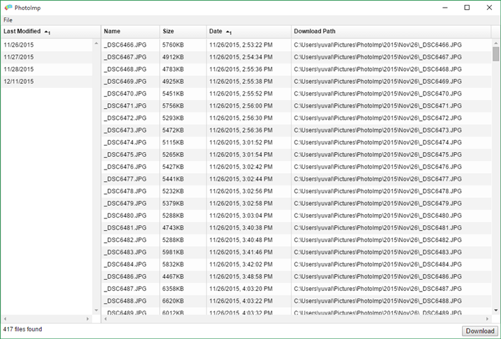
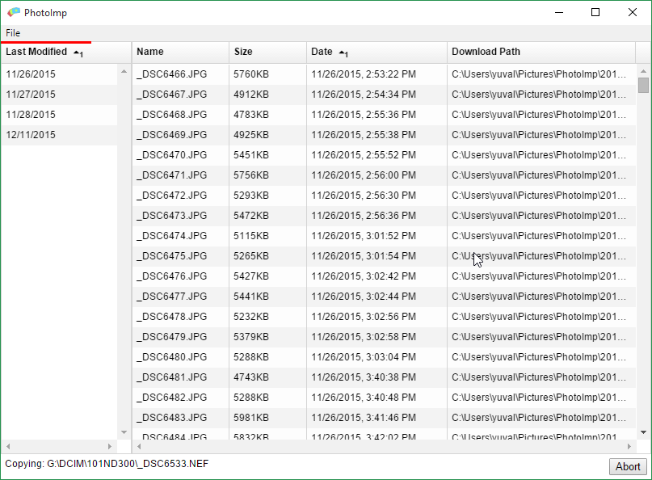
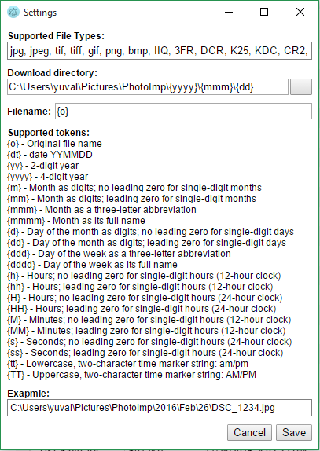

# PhotoImp
A simple tool for easily importing photos from your camera/phone to the computer.
Inspired by Breeze Systems - DownloaderPro, written in electron.js and Angular.

# How to use
PhotoImp can import photos to a templated path using the photos properties. 
For example importing into `c:\photos\{yyyy}\{mmm}\{dd}\{o}` will import photos using the photos date, like `c:\photos\2015\July\21\DSC_1234.jpg`,
this is extremely helpful in organizing your digital photos library. 
It is also possible to select which photos to import or to easily import photos from specific days.

## Downloading files
In the main menu select `File -> Open...` this will open a folder browser, simply select the folder containing the images to download. 
PhotoImp will detect all media files in the folder (media files can be defined in the `settings`) and list them in two tables. 
The table on the left list all the dates of the images, and the main table list all images with some properties (size/date etc), pay attention to the `Download Path`
column, this is where the image will be downloaded to. 
From here you can hit the `download` button to download all images, or select which files to download either by selecting a date from
the table on the left, or specific files from the main table (multi-selection is possible using the Shift/Ctrl keys). 
During download there is a red progress bar on the top, and the `Download` button is replaced with an `Abort` button.

## Settings
Open the settings dialog by selecting `File -> Settings...` from the main menu, here you can set the list of files PhotoImp will consider
as media, set the destination download path and filename. 
The available tokens for templating is listed on the settings dialog along with an example of what the actual path would be.

# Building and Packaging
The project is being built using `electron-packager`, currently I have tested it only on windows,
it can be built using `npm run buildwin`, the output will go to the `build` folder. 
Note that building with `electron-packager` requires to have `electron-prebuilt` as dependency,
both are currently included in the `devDependencies` which makes `npm install` to take quite a while
as it needs to download electron binaries, I'm considering removing it (so building will require to
have `electron-packager` and `electron-prebuilt` globally installed).

# Contributing
Feel free to fix/improve this app just please make sure your code is readable and commented :)